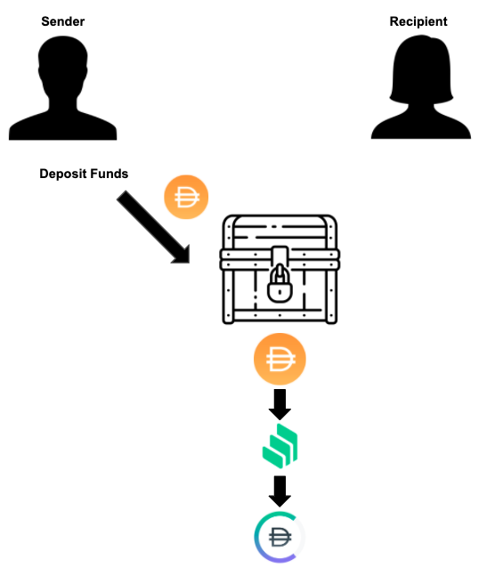
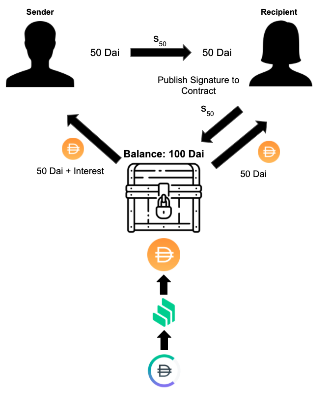
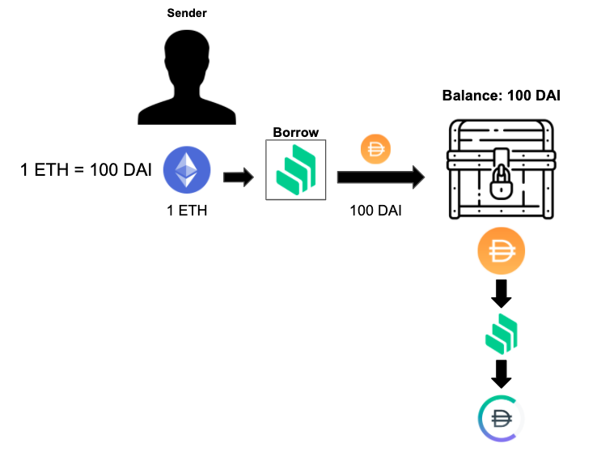
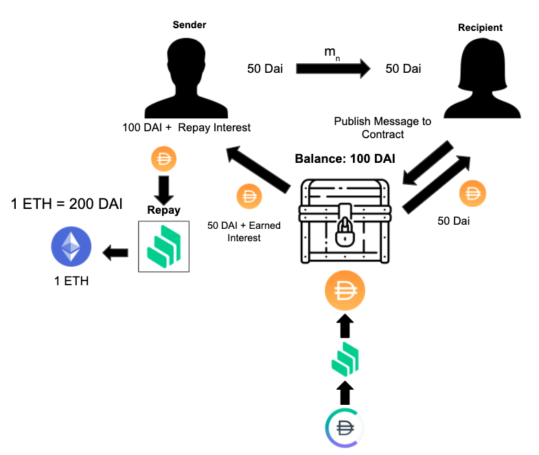

# cChannels
_Earn interest while sending payments off chain_

## Description
cChannels are a series of payment channel contracts that supports both Ether and ERC20 payments. While funds are in the channel, they are locked into Compound and are constantly earning interest for the depositor. Users can directly add more funds to the contract or even borrow against different collateral types supported by Compound to fund their channel.

### Depositing Funds to a cChannel
Sender adds Dai to the cChannel and the Dai is then locked into Compound until the channel is closed.

### Closing a Channel
Recipient closes the channel and withdraws their alloted amount and the sender is returned the remaining amount as well as the interest accrued.

### Borrowing Asset to Fund a Channel
Sender borrows DAI from Compound to fund the channel against Ether.

### Closing a Channel and Repaying Debt
Recipient closes the channel and is given their alloted amount, then the sender re

## Contract Addresses (Ropsten)
* Channel Factory: 0x3FD88e3A0Db2d7BB00636f2cBE44cbc035F6d214
* ETH Channel: 0xC87a2Bc93dbFa4Fa0E0C34Bacfab09dF48F58403
* ERC20 Channel: 0xD35e97d9AFfaf66c4B6d5A5C6C5d0B09643DAE0d

## Contract Addresses (Kovan)
* Channel Factory: 0xC87a2Bc93dbFa4Fa0E0C34Bacfab09dF48F58403
* ETH Channel: 0xD35e97d9AFfaf66c4B6d5A5C6C5d0B09643DAE0d
* ERC20 Channel: 0xC12ddC6979cc2000C93CE7295D3cDe4A2da44395

_Solidity 0.6.6_